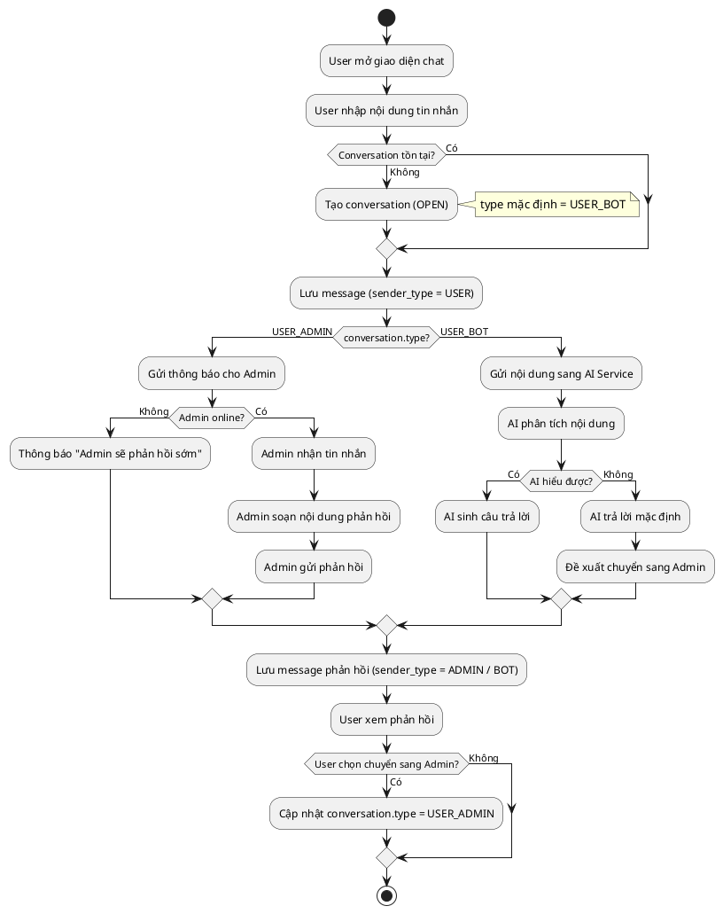
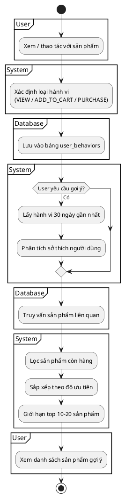

# 📊 SƠ ĐỒ HOẠT ĐỘNG HỆ THỐNG BOOMKIDS

## 1️⃣ SƠ ĐỒ CHAT SYSTEM (USER – ADMIN – CHATBOT AI)

### 📋 PlantUML – Activity Diagram



### 🎯 Giải thích luồng Chat System

#### Bước 1: Khởi tạo phiên chat

- Người dùng mở giao diện chat và gửi tin nhắn đầu tiên
- Hệ thống kiểm tra bảng `conversations`:
  - **Nếu chưa tồn tại** → tạo mới conversation với:
    - `status = OPEN`
    - `type = USER_BOT` (chatbot mặc định)
  - **Nếu đã tồn tại** → sử dụng lại conversation hiện tại
- Tin nhắn của user được lưu vào bảng `messages` với `sender_type = USER`

#### Bước 2: Phân loại xử lý

##### 🔹 Trường hợp 1: Chat với ADMIN (USER_ADMIN)

- Hệ thống gửi thông báo cho Admin
- Kiểm tra trạng thái Admin:
  - **Admin offline** → hiển thị thông báo "Admin sẽ phản hồi sớm"
  - **Admin online**:
    - Admin nhận tin nhắn
    - Soạn nội dung phản hồi
    - Gửi phản hồi cho user

##### 🔹 Trường hợp 2: Chat với CHATBOT (USER_BOT)

- Backend gửi nội dung tin nhắn sang AI Service
- AI phân tích nội dung:
  - **Nếu hiểu được** → sinh câu trả lời phù hợp
  - **Nếu không hiểu** → trả lời mặc định và đề xuất chuyển sang Admin

> ⚠️ **Lưu ý quan trọng:**
>
> - Chatbot AI không truy cập trực tiếp cơ sở dữ liệu.
> - Backend chịu trách nhiệm truy vấn dữ liệu cần thiết và gửi ngữ cảnh cho AI xử lý.

#### Bước 3: Lưu và hiển thị

- Phản hồi (từ Admin hoặc Bot) được lưu vào bảng `messages`
- Hệ thống hiển thị phản hồi cho người dùng

#### Bước 4: Chuyển đổi (tùy chọn)

- User có thể chuyển từ chatbot sang admin bất kỳ lúc nào
- Hệ thống cập nhật `conversation.type = USER_ADMIN`
- Các tin nhắn tiếp theo được chuyển cho Admin xử lý

### 📦 Bảng dữ liệu sử dụng

```sql
-- conversations
CREATE TABLE conversations (
    id BIGINT PRIMARY KEY,
    user_id BIGINT,
    type ENUM('USER_BOT', 'USER_ADMIN') DEFAULT 'USER_BOT',
    status ENUM('OPEN', 'CLOSED') DEFAULT 'OPEN',
    created_at TIMESTAMP,
    updated_at TIMESTAMP
);

-- messages
CREATE TABLE messages (
    id BIGINT PRIMARY KEY,
    conversation_id BIGINT,
    sender_type ENUM('USER', 'ADMIN', 'BOT'),
    sender_id BIGINT NULL,
    content TEXT,
    created_at TIMESTAMP
);
```

---

## 2️⃣ SƠ ĐỒ RECOMMENDATION SYSTEM (LEVEL 2 – BEHAVIOR BASED)

### 📋 PlantUML – Activity Diagram



### 🎯 Giải thích luồng Recommendation System

#### Bước 1: Ghi nhận hành vi

- Hệ thống tự động ghi nhận các hành vi:
  - **VIEW**: xem chi tiết sản phẩm
  - **ADD_TO_CART**: thêm vào giỏ hàng
  - **PURCHASE**: mua hàng
- Thông tin lưu gồm:
  - `user_id`
  - `product_id`
  - `action`
  - `created_at`

#### Bước 2: Lưu trữ dữ liệu

- Hành vi được lưu vào bảng `user_behaviors`
- Đây là nguồn dữ liệu chính cho hệ thống gợi ý

#### Bước 3: Kích hoạt gợi ý

Recommendation System được kích hoạt khi:

- User truy cập trang chủ ("Gợi ý cho bạn")
- User xem chi tiết sản phẩm ("Sản phẩm tương tự")
- User vừa mua hàng ("Gợi ý mua kèm")

#### Bước 4: Phân tích sở thích

Hệ thống phân tích:

- Danh mục sản phẩm hay xem
- Giới tính sản phẩm (bé trai / bé gái)
- Khoảng giá thường mua
- Size và màu sắc phổ biến

#### Bước 5: Truy vấn & sắp xếp

**Lấy sản phẩm:**

- Cùng danh mục
- Cùng giới tính
- Trong khoảng giá tương tự
- `status = ACTIVE`
- `quantity > 0`

**Sắp xếp ưu tiên:**

1. Sản phẩm đã thêm giỏ nhưng chưa mua
2. Sản phẩm cùng danh mục đã mua
3. Discount cao
4. Sản phẩm mới

### 📦 Bảng dữ liệu sử dụng

```sql
CREATE TABLE user_behaviors (
    id BIGINT PRIMARY KEY,
    user_id BIGINT,
    product_id BIGINT,
    action ENUM('VIEW', 'ADD_TO_CART', 'PURCHASE'),
    created_at TIMESTAMP
);

CREATE INDEX idx_user_behaviors_user_time
ON user_behaviors(user_id, created_at DESC);
```

### 🧠 Thuật toán gợi ý (Pseudo-code – Rule-based)

```python
# Rule-based recommendation (non-ML)

def get_recommendations(user_id, limit=20):
    behaviors = get_user_behaviors(user_id, days=30)
    preferences = analyze_preferences(behaviors)

    products = query_products(
        categories=preferences['categories'],
        gender=preferences['gender'],
        price_range=preferences['price_range'],
        status='ACTIVE',
        has_stock=True
    )

    scored = []
    for product in products:
        score = calculate_score(product, behaviors)
        scored.append((product, score))

    scored.sort(key=lambda x: x[1], reverse=True)
    return [p[0] for p in scored[:limit]]
```

---

## 🚀 HƯỚNG PHÁT TRIỂN

- Tích hợp AI Recommendation (Collaborative Filtering)
- Huấn luyện chatbot từ lịch sử chat
- Cá nhân hóa theo độ tuổi của bé
- Sử dụng WebSocket cho chat realtime

---

## 🎓 KẾT LUẬN

- **Chat System** hỗ trợ Admin + Chatbot AI
- **Recommendation System** dựa trên hành vi người dùng
- Thiết kế đơn giản, hiệu quả, dễ mở rộng
- Phù hợp cho đồ án tốt nghiệp và triển khai thực tế
